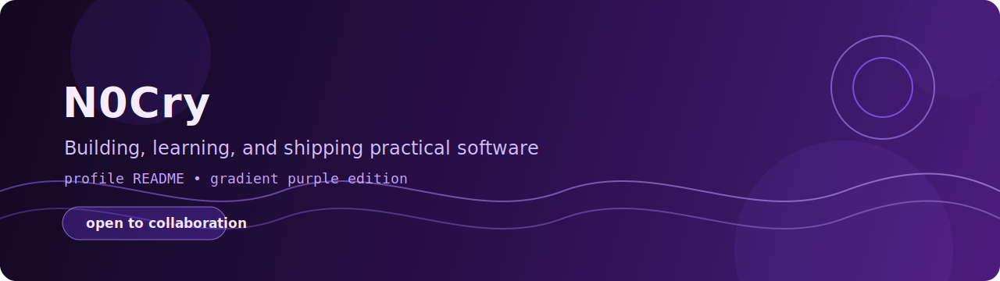

# Hello, I'm Naufal

  

  
  
  

## About Me

I am building my journey in software development, one project at a time.
Still growing, still learning, but always shipping.

- Learning by doing real projects
- Interested in web apps, automation, and practical tools
- Goal: become a reliable full-stack engineer

## Tech Stack (Growing)

  
  
  
  
  
  

## GitHub Snapshot

  
  

  

## Current Focus

- Build consistent coding routine
- Improve clean architecture mindset
- Publish more meaningful repositories

## Let's Connect

  

